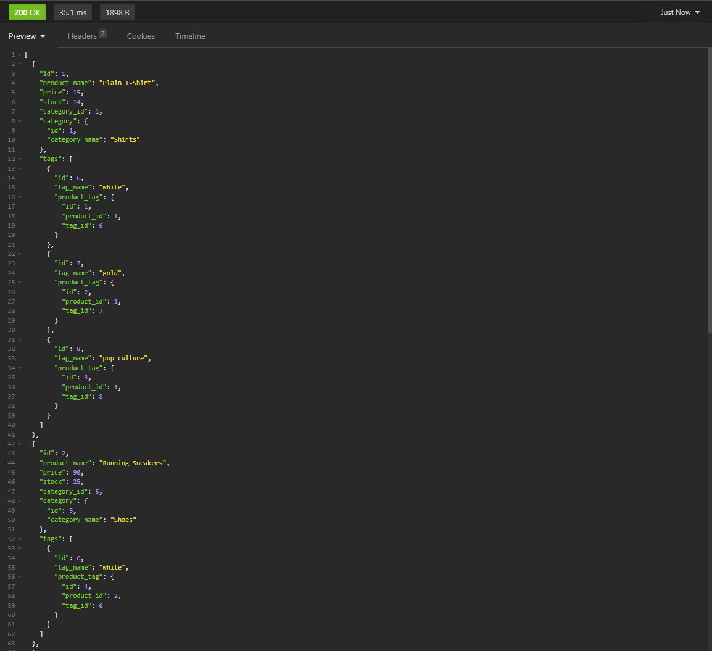
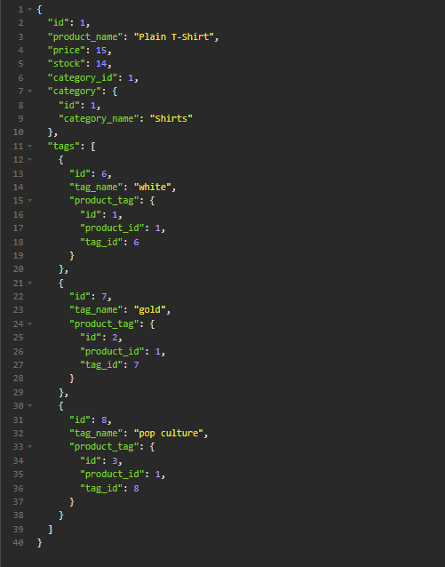
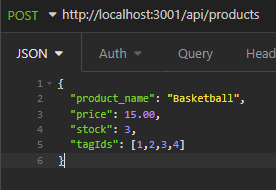
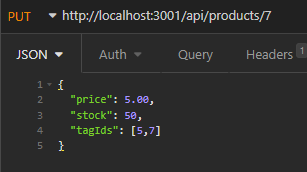
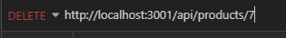

# E-Commerce Retail

  

  ## Description

  Provides an Object-Relational Mapping (ORM) architecture back-end for an e-commerce website. The back-end makes use of Express.js, Sequelize, and MySQL. Various api routes are included.

  ## Table of Contents

  - [Installation](#installation)
  - [Usage](#usage)
  - [Credits](#credits)
  - [License](#license)
  - [Contribution](#contribution)
  - [Test](#test)

  ## Installation

  To install the application, navigate to the GitHub Repository at the link [Repository Link](https://github.com/nambui17/E-commerce). Either clone the code with 
  ```
  git clone <repo SSH here>
  ``` 
  or download the repository in a compressed zip file and extract to a desired location. 
  
  Install any dependencies using the command:
  ```
  npm i
  ```
  Initialize the database by logging into MySQL on the local machine by running the command:
  ```
  mysql -u root -p
  ```
  Then log in with the root password. Instead of logging into a root user, you can also log into another MySQL user by replacing the `root` with the username of the user. Be sure that the user has permissions to create databases in order to start up the application. Initialize the database by running the mysql command:
  ```
  source db/schema.sql
  ```
  Quit out of the mysql command line interface with the command:
  ```
  quit;
  ```
  In the command line, run the command 
  ```
  node seeds/index.js 
  ```
  to seed the database with data. Now the database is ready to be used!

  ## Usage

  To use the application, start the server by running the command:
  ```
  npm start
  ```
  or
  ```
  node server.js
  ```
  When the server is started, GET, POST, DELETE, and PUT requests can be made to the database. Example requests are shown through Insomnia.

  GET All request:

  

  GET One request:

  

  POST request:

  

  PUT update:

  

  DELETE request:

  

  A video walkthrough of the starting the server, and making requests can be viewed in the link.

  [Walkthrough Link](https://watch.screencastify.com/v/yCSp6DFqGF8VGw6AQTXK)

  ## Credits
  N/A

  ## License 

  This project is covered under the MIT License. View the Repo or navigate to the license link below.

  [MIT License](https://spdx.org/licenses/MIT.html)

  ## Contributing

  N/A

  ## Tests

  N/A

  ## Questions

  Please visit my GitHub profile or reach me at my email for any further questions!

  GitHub Link: [nambui17](https://github.com/nambui17)

  E-mail: nam.bui17@icloud.com

  
  
  
  
  